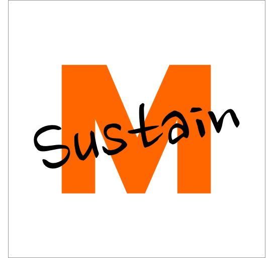
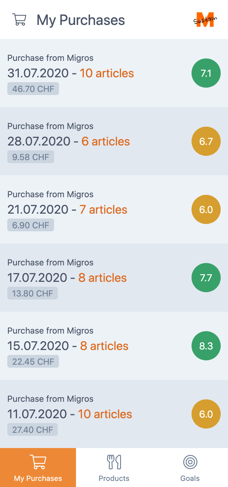
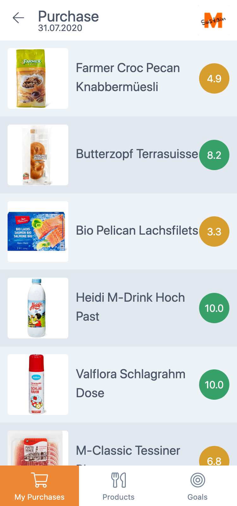
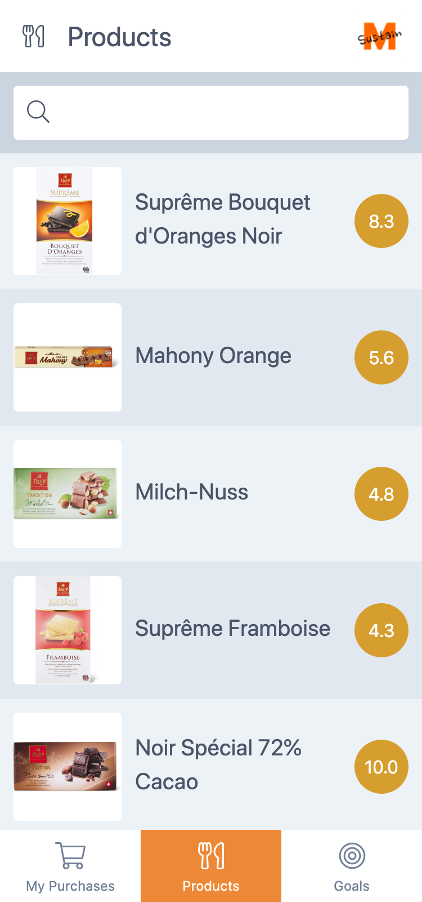
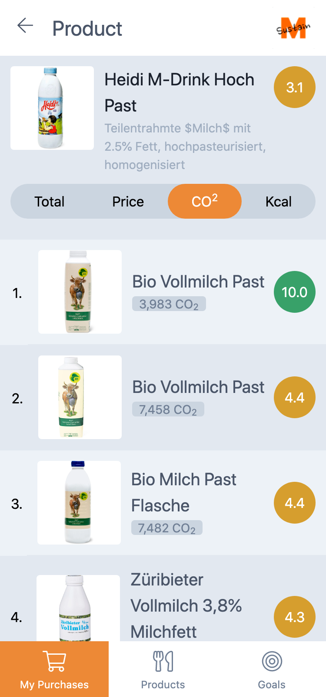
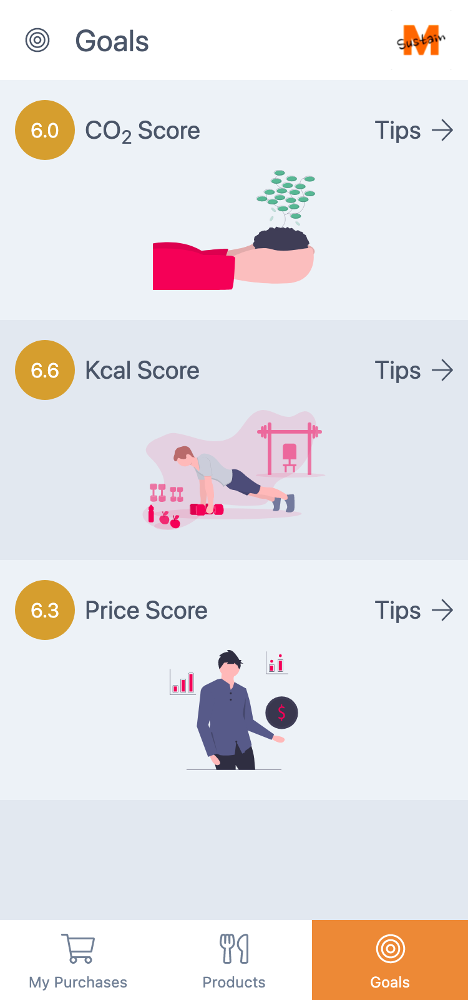
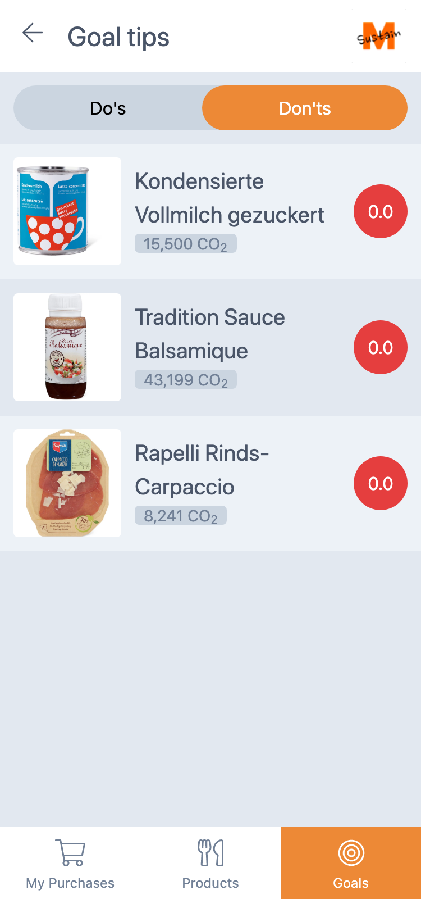

<h1 align="center">
  
</h1>
<h2 align="center">M-Sustain</h2>

  
  

## Motivation
Sustainability is the main theme of "#2 FOOD FOR THOUGHT" by IBM & SwissRe and "#18 STEP-BY-STEP: REDUCING CARBON FOOTPRINT" by Zurich Insurance. We wanted to find a solution for individuals to help them reduce their CO2 footprint. The "#1 LET'S CREATE DIGITAL PRODUCT TWINS" challenge by Migros asked for solutions to help customers make better buying decisions. In order to stop climate change everyone has to adapt their own behaviors, so choosing a more sustainable product means choosing a better product. We could not find any apps on the market that provide CO2 information of different products to the customer, so we decided to combine the product data from Migros with the CO2 data from the Eaternity.ai API. Our goal is to help the customers make better buying decisions every day.

## Screenshots

### Purchases

  
  

### Products

  
  

### Goals

  
  

## Project structure

| Directory | Description |
| --- | --- |
| docs | screenshots and promo images of the app |
| nestjs | search api for similar product |
| web | angular pwa frontend |
| web-fetcher | extraction of api information and data aggregation |
