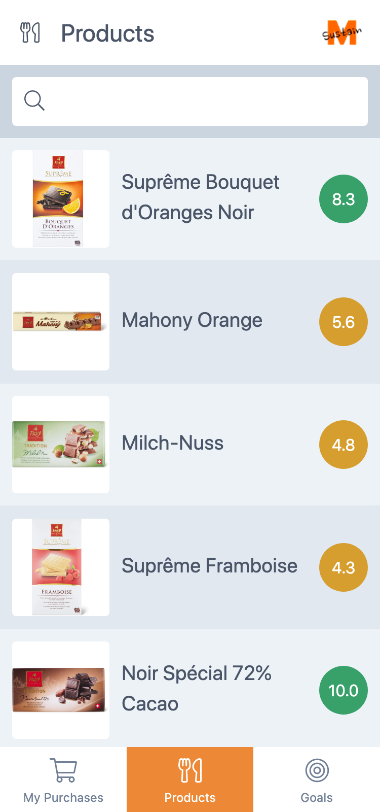

<h1 align="center">
  
</h1>
<h2 align="center">M-Sustain</h2>

  
  

## Motivation

## Screenshots

### Purchases

  
  

### Products

  
  

### Goals

  
  

## Project structure

| Directory | Description |
| --- | --- |
| docs | screenshots and promo images of the app |
| nestjs | search api for similar product |
| web | angular pwa frontend |
| web-fetcher | extraction of api information and data aggregation |
